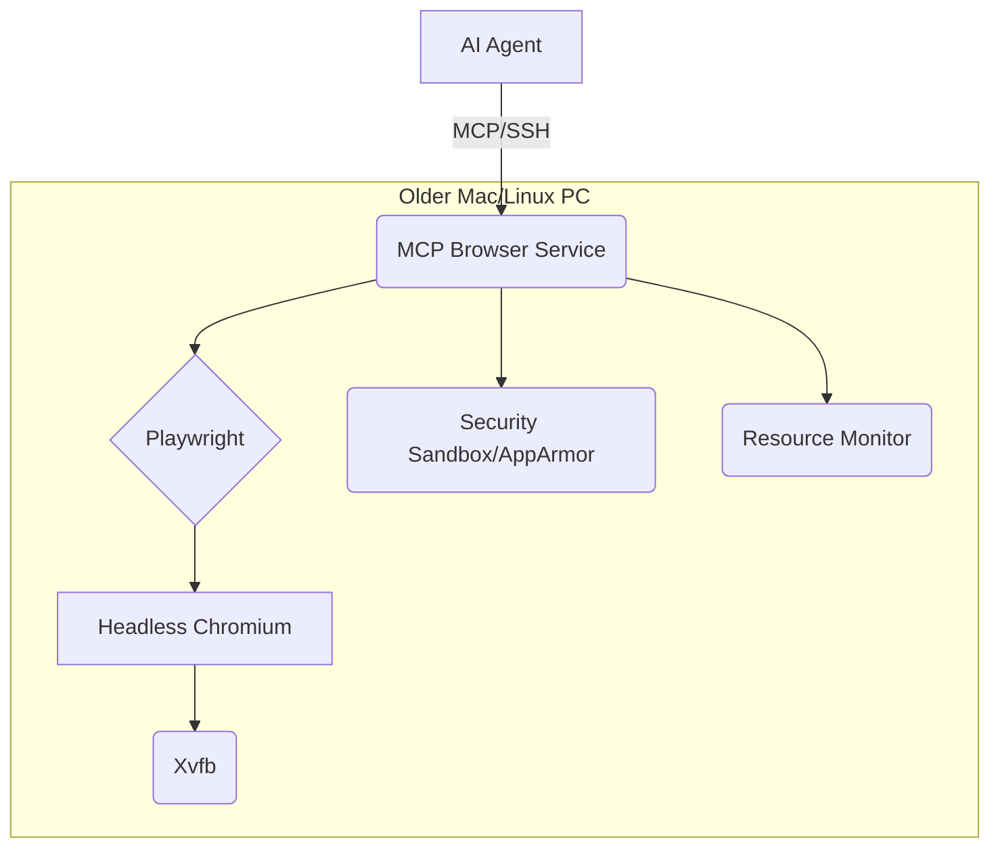

# Project Brief - MCP Browser

## Overview

*   **Purpose**: Enterprise-grade secure browser automation for L3 AI coding agents.
*   **Function**: Enables AI agents to test frontends, evaluate rendering, and identify issues in real browsers.

## Core Requirements (Summarized)

1.  **Platform**: Headless browser (Playwright/Chromium) via Xvfb.
2.  **Security**: AppArmor, non-root, resource limits, env secrets, isolated display.
3.  **Deployment**: One-command deploy (Docker), resource pooling.
4.  **Verification**: Static analysis, automated tests (CI), security checks.
5.  **Agent Integration**: MCP via WebSockets/API, screenshot/DOM analysis.

## Architecture Sketch

## Success Criteria

*   One-command deployment.
*   Secure container isolation.
*   Accurate rendering analysis.
*   Resource efficient (target < 300MB RAM/instance).
*   AI agents can effectively identify frontend issues.

## Out of Scope

*   Interactive UI for humans.
*   Browser extension management.
*   Multi-user session management.
*   Advanced anti-detection features. 