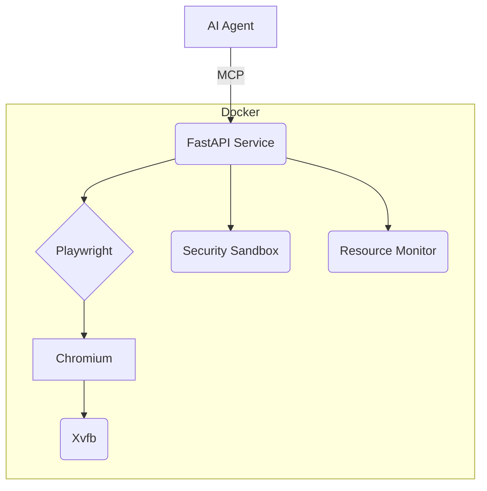

# Project Brief - MCP Browser (Optimized)

## Core Purpose
Secure, resource-efficient browser automation service for L3 AI coding agents (via MCP) to test frontend rendering and functionality.

## Core Requirements
*   **Platform**: Headless Chromium via Playwright & Xvfb.
*   **Security**: AppArmor, non-root, resource limits, network isolation (Docker).
*   **Deployment**: Docker Compose.
*   **Verification**: Pytest, CI (GitHub Actions).
*   **Integration**: MCP via WebSockets/HTTP API (FastAPI). Key results: screenshots, DOM, event streams.

## Architecture Sketch

## Success Criteria
*   One-command deploy via `docker-compose`.
*   Secure isolation (AppArmor, network policies).
*   Accurate rendering analysis outputs.
*   Resource target: < 300MB RAM per browser instance.
*   AI agent usability confirmed via integration tests.

## Out of Scope
*   Human-facing UI.
*   Browser extensions.
*   Multi-user sessions.
*   Advanced anti-detection. 