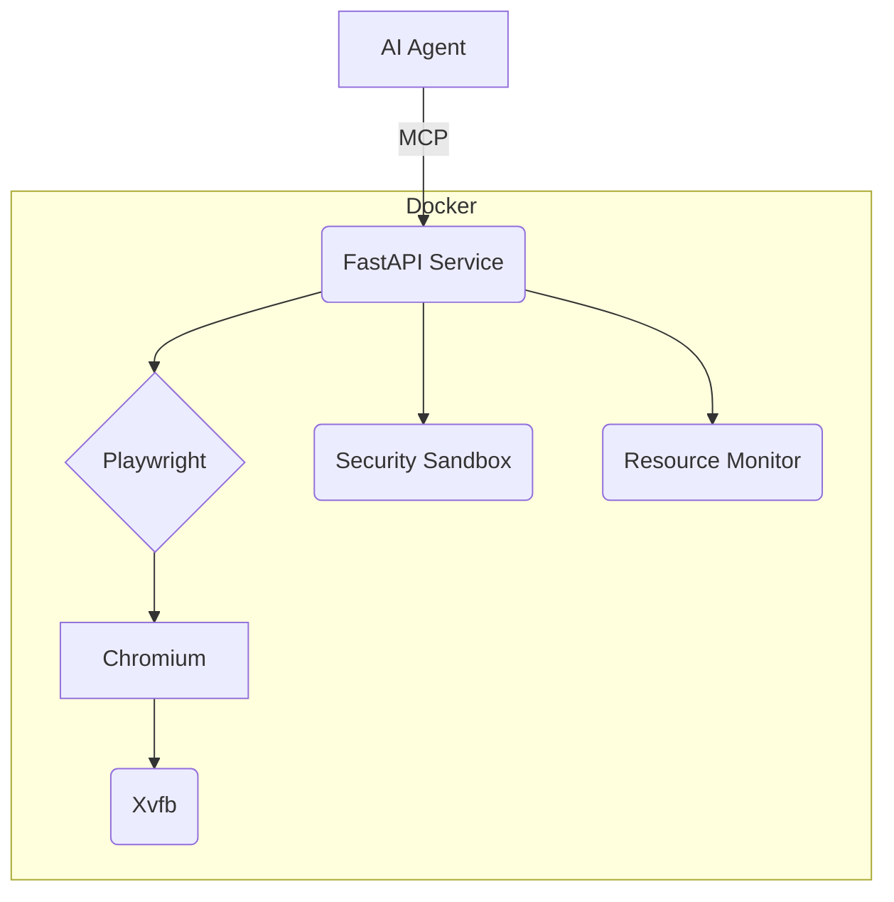

# Project Brief - MCP Browser (Optimized)

## Core Purpose
*   Secure, resource-efficient browser automation service for MCP AI agents.
*   Enables frontend testing (rendering, functionality).

## Core Needs
*   **Platform**: Headless Chromium via Playwright.
*   **Environment**: Docker Compose deployment.
*   **Security**: Docker isolation (network, non-root, resource limits), AppArmor.
*   **Interface**: FastAPI (HTTP API), WebSockets (MCP integration). Key results: screenshots, DOM, event streams.
*   **Verification**: Pytest suite, CI (GitHub Actions).

## Success Criteria
*   One-command deploy (`docker-compose`).
*   Verified secure isolation.
*   Accurate rendering analysis outputs.
*   Target: < 300MB RAM per browser instance.
*   Usable by AI agents (verified via integration tests).

## Out of Scope
*   Human-facing UI.
*   Browser extensions.
*   Multi-user sessions.
*   Advanced anti-detection features.

## Architecture Sketch
