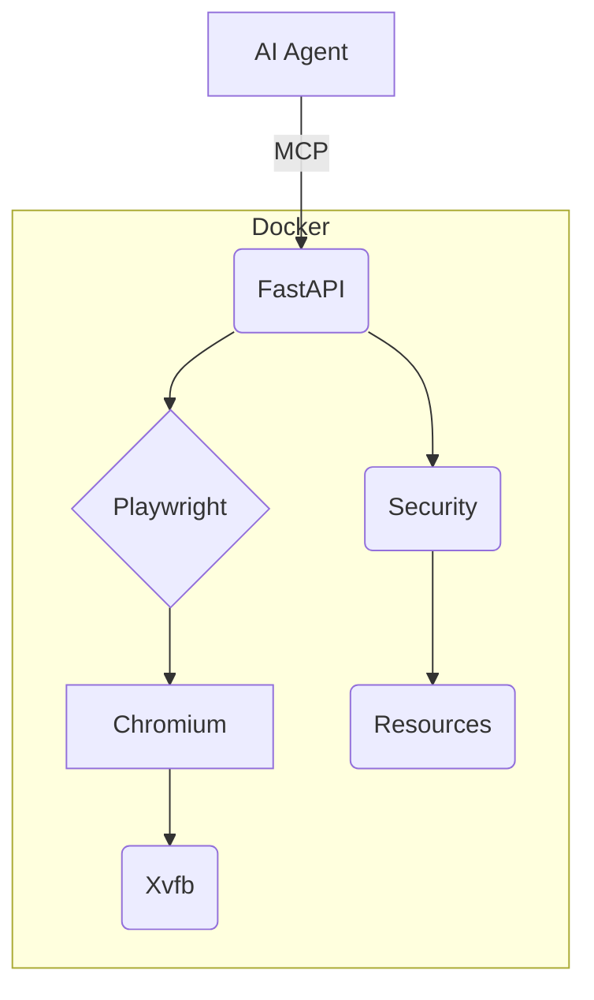

# Project Brief - MCP Browser

## Purpose
- Secure browser automation for MCP AI agents
- Frontend testing capabilities

## Core Needs
- **Platform**: Playwright (Chromium)
- **Environment**: Docker
- **Security**: AppArmor, isolation
- **Interface**: FastAPI, WebSockets
- **Testing**: Pytest

## Success Criteria
- One-command deploy
- Secure isolation
- <300MB RAM/instance
- AI agent usability

## Out of Scope
- Human UI
- Extensions
- Multi-user
- Anti-detection

## Architecture
