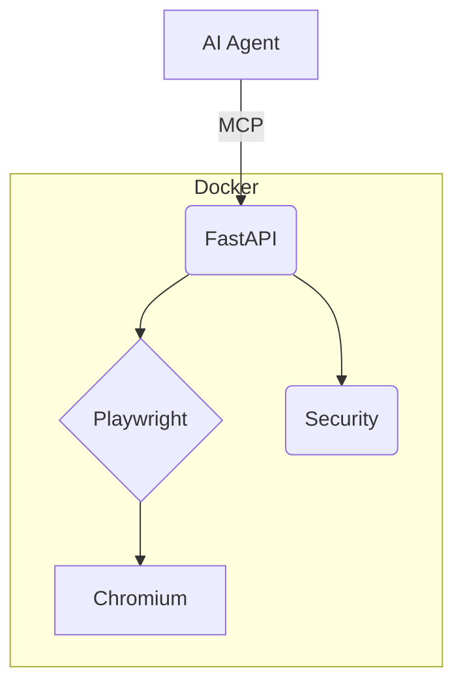

# System Architecture - MCP Browser

## Core Flow
AI Agent → MCP → FastAPI → Playwright → Chromium → Results

## Key Components
- **FastAPI**: API, WebSockets, command handling
- **BrowserPool**: Browser lifecycle, resources, isolation
- **Docker**: Security boundaries, dependencies

## Patterns
- **Facade**: BrowserPool simplifies Playwright
- **Command**: Requests map to browser actions
- **Observer**: WebSockets for events
- **Pool**: Browser context management
- **Error**: Custom exceptions with codes

## Security
- **Network**: Domain filtering, rate limiting
- **Container**: AppArmor, non-root, quotas
- **Application**: Input validation, auth

## API Structure
- `/api/browser/*`: Actions (navigate, click)
- `/api/{feature}/*`: Analysis (screenshots, DOM)
- `/ws/events`: Event streaming

## Data Flow
1. Agent sends command
2. Service validates
3. Translates to Playwright
4. Executes in Chromium
5. Captures results
6. Returns formatted data
