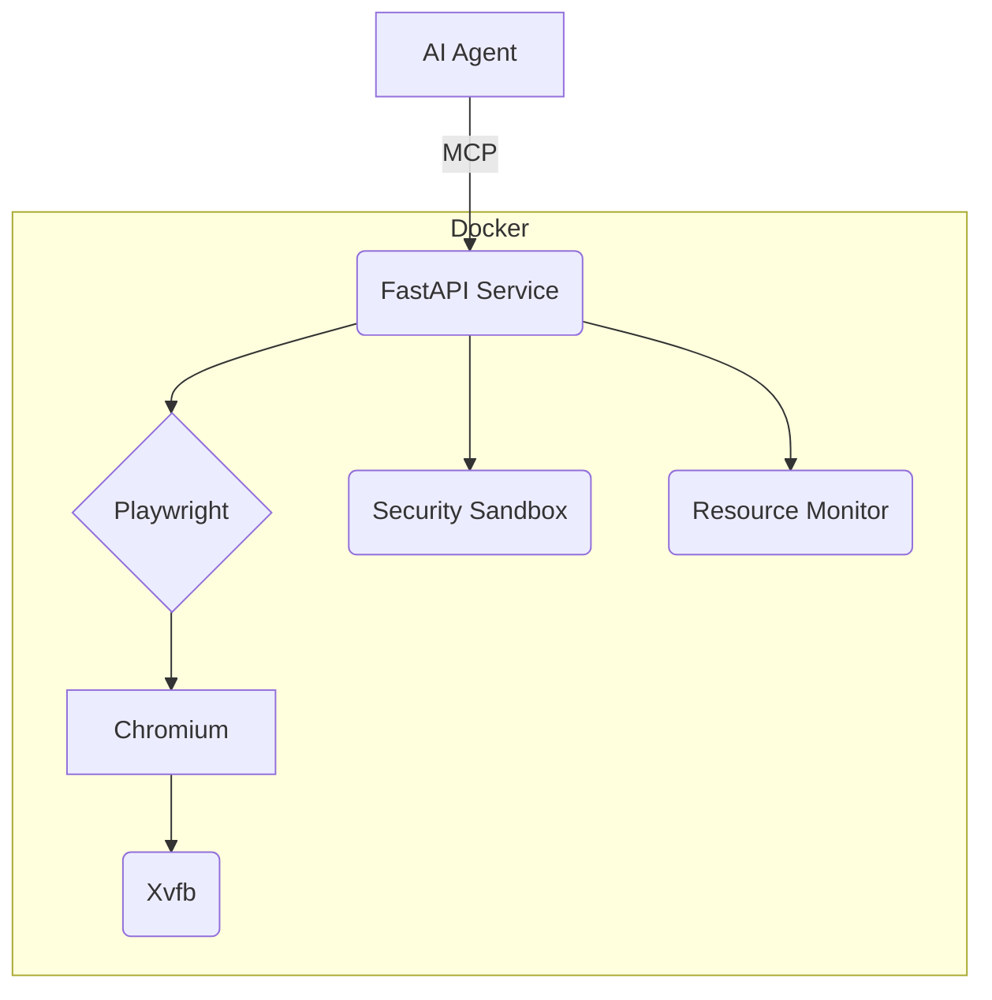

# System Architecture & Patterns - MCP Browser (Optimized)

## Architecture Overview
*   FastAPI service acts as a facade over Playwright/Chromium.
*   Uses Xvfb for headless rendering.
*   Runs within Docker with AppArmor/resource limits.
*   Communicates with AI agents via MCP (WebSocket/HTTP).

## Key Components
*   **FastAPI Service**: API endpoints, WebSocket handling, command processing, pool management.
*   **BrowserPool/Instance**: Manages Playwright browser lifecycle, contexts, resource monitoring (idle/limits), network isolation rules.
*   **Playwright Engine**: Executes browser actions.
*   **Xvfb Display**: Enables visual operations in headless mode.
*   **Docker Container**: Isolation, dependency management, security boundaries (AppArmor, non-root, network).

## Design Patterns
*   **Facade**: `BrowserPool`/`FastAPI` simplifies Playwright interaction.
*   **Command**: API requests map to browser actions.
*   **Observer**: WebSockets for event streaming.
*   **Factory/Pool**: `BrowserPool` manages `BrowserInstance` creation/reuse/cleanup.
*   **Dependency Injection**: Used implicitly by FastAPI, useful for testing.
*   **Error Handling**: Custom `MCPBrowserException`, standardized codes/responses.

## Security Strategy (Defense-in-Depth)
*   **Network**: Docker networks, Optional SSH Tunnel, Rate Limiting (TODO), `BrowserPool` domain filtering.
*   **Application**: Input validation (Pydantic), Auth (TODO).
*   **Container**: AppArmor, Non-root user, Resource quotas (Docker).
*   **Browser**: Isolated contexts.

## Key Technical Decisions
*   **Playwright/Chromium**: Reliability, modern API.
*   **FastAPI**: Async performance, type safety, docs.
*   **Docker**: Consistency, isolation.
*   **Xvfb**: Lightweight headless visual rendering.
*   **uv**: Fast package management.
*   **pytest**: Testing framework.

## Data Flow Summary

1.  Agent sends MCP command (via SSH).
2.  Service receives/validates.
3.  Translates to Playwright op.
4.  Playwright executes in Chromium (via Xvfb).
5.  Results captured (DOM, screenshot, etc.).
6.  Service formats/returns results.
7.  Operation logged.

## Core API Endpoint Examples (Structure)

*   `/api/screenshots/capture` (POST)
*   `/api/dom/extract` (POST)
*   `/api/css/analyze` (POST)
*   `/api/accessibility/test` (POST)
*   `/api/responsive/test` (POST)
*   `/api/browser/navigate` (POST)
*   `/api/browser/click` (POST)
*   `/api/events/subscribe` (WebSocket)

*(Detailed request/response schemas available in OpenAPI docs/code)*
