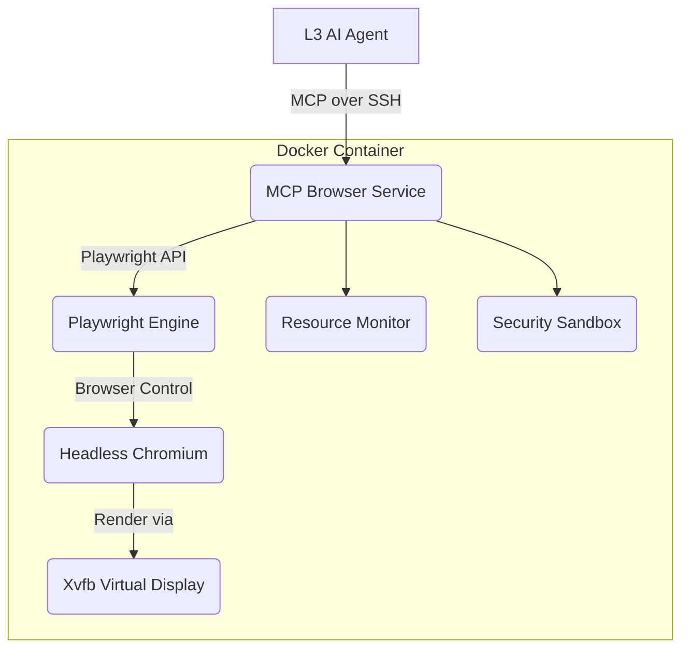

# System Architecture & Patterns - MCP Browser

## Architecture Overview

*   FastAPI app bridging clients (L3 AI Agents via MCP) and Playwright (headless browser).
*   Modular: HTTP API, WebSocket, Browser Control, Error Handling, Data Processing layers.

## Key Components & Responsibilities

*   **MCP Browser Service (FastAPI)**: Manage sessions, process MCP commands, return output, log, handle security.
*   **Playwright Engine**: Launch/manage browser, execute actions, capture state.
*   **Xvfb Display**: Provide X11 env for headless browser, enable visual ops.
*   **Docker Container**: Consistent/isolated environment, resource mgmt, security boundaries.
*   **SSH Tunnel**: Secure remote access & encryption.

## Design Patterns Employed

*   **Microservice**: Single responsibility components, defined interfaces.
*   **Command**: Browser ops as commands (serialized, validated, executed).
*   **Observer**: WebSockets for real-time state updates (pub/sub).
*   **Factory**: Browser instance creation & config management.
*   **REST API**: Resource-oriented endpoints, JSON payloads, consistent responses.
*   **WebSocket**: Connection pool, pub/sub management, event filtering (URL, page ID).
*   **Facade**: Simplified browser control interface over Playwright complexity.
*   **Error Handling**: Standardized structure (code, msg), detailed logging.

## Data Flow Summary

1.  Agent sends MCP command (via SSH).
2.  Service receives/validates.
3.  Translates to Playwright op.
4.  Playwright executes in Chromium (via Xvfb).
5.  Results captured (DOM, screenshot, etc.).
6.  Service formats/returns results.
7.  Operation logged.

## Security Architecture (Defense-in-Depth)

*   **Network**: SSH Tunnel encryption, Firewall rules, Rate limiting.
*   **Application**: JWT Auth, Input validation/sanitization.
*   **Container**: AppArmor, Non-root user, Resource quotas.
*   **Browser**: Isolated contexts, No persistent storage, Network restrictions (planned).

## Key Technical Decisions & Rationale

*   **Playwright**: Reliability, cross-browser, modern API, performance.
*   **Chromium**: Best compatibility, perf, dev tools, security updates.
*   **Docker**: Consistency, isolation, dependency mgmt, scaling.
*   **FastAPI**: Async perf, auto-docs, type safety, WebSocket support.
*   **Xvfb**: Lightweight, no GPU needed, stable for headless.

## Core API Endpoint Examples (Structure)

*   `/api/screenshots/capture` (POST)
*   `/api/dom/extract` (POST)
*   `/api/css/analyze` (POST)
*   `/api/accessibility/test` (POST)
*   `/api/responsive/test` (POST)
*   `/api/browser/navigate` (POST)
*   `/api/browser/click` (POST)
*   `/api/events/subscribe` (WebSocket)

*(Detailed request/response schemas available in OpenAPI docs/code)*
